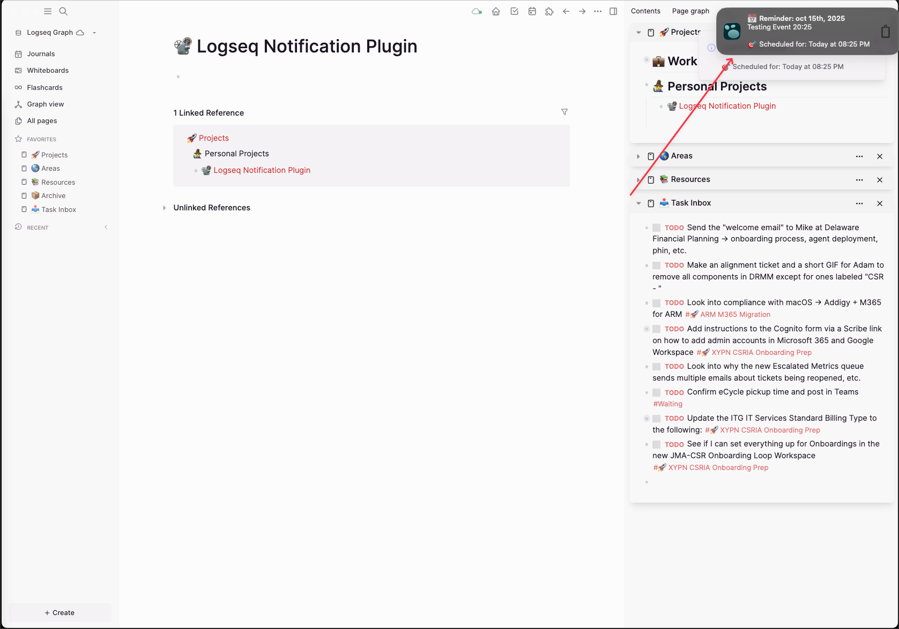
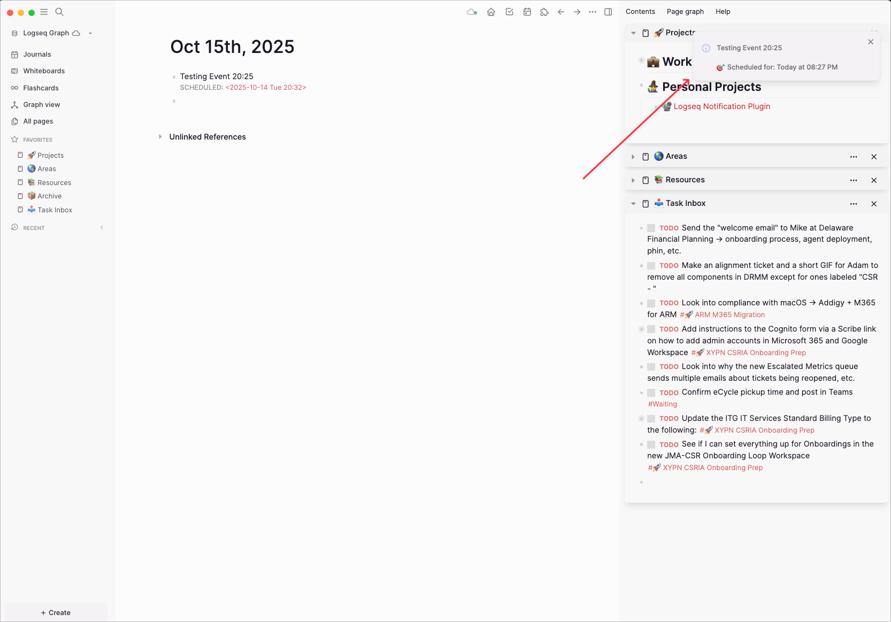

# Logseq Reminder Notifications Plugin (Database Version)

**v1.3.0 - FEATURE RELEASE**

  

Desktop and in-app notifications for scheduled blocks in Logseq. Never miss your scheduled tasks and reminders again!

> **Important:** This plugin is designed for **Logseq Database (DB) graphs**. If you're using traditional Logseq Markdown/File-based graphs, please use the Markdown version of this plugin instead.

## Demo


*Desktop notification and in-app message for scheduled reminders*

## Key Features

## Current Status

**WORKING FEATURES:**
- Desktop notifications for scheduled blocks
- In-app toast messages
- Automatic block detection and parsing
- Reliable notification timing
- Manual rescan via `/reminders: rescan` command
- Smart parsing of scheduled timestamps
- Duplicate notification prevention
- Past event filtering (ignores events older than 5 minutes)

**NEW IN v1.3.0:**
- Settings GUI (Logseq-native)
- Multiple reminder intervals (comma-separated, e.g., `15,5,0`)
- All-day reminders with configurable time (e.g., `09:00`)
- Polling interval and daily rescan hour configurable
- Refreshed bell icon for desktop notifications
- Quiet hours to disable notifications during specified times

**DB VERSION SPECIFIC:**
- Updated schema queries for Database version
- Uses `:block/title` instead of `:block/content` for block text
- Uses `:logseq.property/scheduled` for property-based scheduling
- Supports both SCHEDULED: format and scheduled:: property
- Compatible with Logseq's new Database storage format

## Installation

### Prerequisites

- **Logseq Database (DB) graph** - This plugin works with Logseq's new Database version only
- If you're using traditional Markdown/File-based graphs, this plugin will NOT work correctly. Use the Markdown version instead.

### Steps

1. **Download this repository:**
   ```bash
   git clone https://github.com/Joemnewton/logseq-reminder-notifications-db.git
   ```

2. **Load in Logseq:**
   - Settings → Plugins → "Load unpacked plugin"
   - Select the `logseq-reminder-notifications-db` folder
   - Enable the plugin

3. **Grant permissions:**
   - Allow notifications when prompted
   - Check browser notification settings if needed

## Usage

### Supported Formats

**Property-based scheduling (RECOMMENDED for DB version):**
```
- Call the dentist
  scheduled:: 2025-10-14 14:30
```

**Journal-style timestamps (also supported):**
```
SCHEDULED: <2025-10-14 Mon 14:30> Call the dentist
SCHEDULED: <2025-10-15 Tue 09:00> Team meeting
```

### Commands

- `/reminders: rescan` - Manually refresh reminder list

## Screenshots

### Desktop Notifications

*Native desktop notification that appears even when Logseq is minimized*

### In-App Notifications

*Toast message that appears within Logseq when you're actively using the app*

### Console Output (Optional)
For debugging, you can view plugin activity in the browser console (F12 → Console tab):
- Plugin startup messages
- Block scanning and detection logs
- Notification trigger events

## Configuration

Open Logseq → Settings → Plugins → Reminder Notifications (DB).

Settings:
- `Default Reminder Intervals` (string): Comma-separated minutes before event, e.g. `5,0` or `15,5,0`
- `Enable All-Day Reminders` (boolean): Enable reminders for date-only schedules
- `All-Day Reminder Time` (string): Time for all-day reminders, e.g. `09:00`
- `Polling Interval (seconds)` (number): How often to check due reminders (10-300 seconds)
- `Daily Rescan Hour` (number): Hour of day to re-scan database (0-23)
- `Enable Quiet Hours` (boolean): Disable notifications during specified hours
- `Quiet Hours Start` (number): Hour to start quiet hours (0-23, e.g., 22 for 10 PM)
- `Quiet Hours End` (number): Hour to end quiet hours (0-23, e.g., 7 for 7 AM)

## What's New (v1.3.0)

- Added full Settings GUI using `logseq.useSettingsSchema()`
- Configurable reminder intervals (comma-separated input)
- Optional all-day reminders with custom time
- Configurable polling interval and daily rescan hour
- Updated desktop notification icon to a bell
- Quiet hours feature to disable notifications during sleep/work hours
- **DB version**: Updated schema queries for Database compatibility

## Database Version Differences

This DB version differs from the Markdown version in these key ways:

1. **Schema Changes:**
   - Uses `:block/title` attribute instead of `:block/content` for querying block text
   - Uses `:logseq.property/scheduled` for property-based scheduling queries
   - Supports SCHEDULED: <date> format found in `:block/title`
   - Handles both string and numeric date formats
   - Queries adapted for DB-based graph structure

2. **Storage Format:**
   - Compatible with Logseq's SQLite database storage
   - Works with graphs stored in `~/logseq/graphs/GRAPH-NAME/db.sqlite`

3. **Property Format:**
   - Optimized for DB version's property handling
   - Supports both property-based (scheduled::) and inline (SCHEDULED:) formats
   - Better integration with DB version's type system

## Troubleshooting

**No notifications?**
1. Verify you're using a Logseq Database (DB) graph, not a Markdown/File-based graph
2. Check browser console (F12) for error messages
3. Run `/reminders: rescan` to refresh
4. Verify your block uses supported timestamp format:
   - `scheduled:: 2025-10-14 14:30` (property format)
   - `SCHEDULED: <2025-10-14 Mon 14:30> Task` (journal format)

**Console debugging:**
- Look for `Reminder Notifications plugin v1.3.0 starting...`
- Check for detailed parsing messages when running rescan

## Development Roadmap

Upcoming ideas:

1. Notification templates and custom sounds
2. Advanced overdue handling and snooze functionality
3. Repeating/recurring reminders

## Contributing

1. Fork this repository
2. Test your changes thoroughly
3. Submit a pull request with clear description

## License

MIT License - See LICENSE file for details.

## Support

For issues:
1. Check browser console for errors
2. Include your Logseq version (must be DB version) and block format
3. Create an issue on GitHub with reproduction steps
